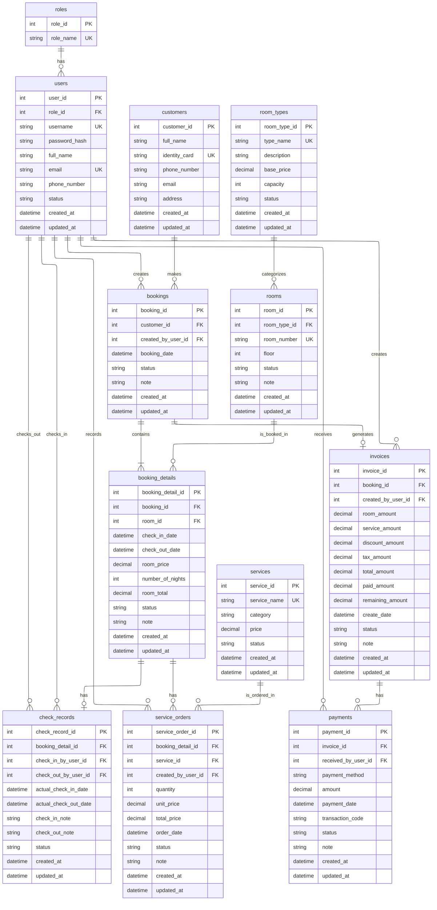

# Hotel Management Database Explanation

## 1. Tổng quan database

Database này được thiết kế cho phần mềm **quản lý khách sạn và dịch vụ nội bộ**.

Hệ thống có 3 role đăng nhập chính:

- **Admin**: quản lý tài khoản nhân viên, phòng, loại phòng, dịch vụ và cấu hình hệ thống.
- **Manager**: xem báo cáo doanh thu, báo cáo phòng, báo cáo dịch vụ, theo dõi hoạt động vận hành.
- **Receptionist**: tạo booking, check-in, check-out, ghi nhận dịch vụ, tạo hóa đơn và nhận thanh toán.

Lưu ý quan trọng:

- **Customer không đăng nhập hệ thống**.
- Customer chỉ là dữ liệu khách thuê phòng.
- Người thao tác nghiệp vụ chính là **Receptionist**.
- Admin, Manager, Receptionist đều được lưu trong bảng `users` và phân quyền thông qua bảng `roles`.

---

## 2. ERD Mermaid



---

# 3. Giải thích chi tiết từng bảng

---

## 3.1. Bảng `roles`

### Mục đích

Bảng `roles` dùng để lưu danh sách vai trò trong hệ thống. Vì phần mềm dùng nội bộ nên các vai trò chính là:

- Admin
- Manager
- Receptionist

Thay vì tạo riêng bảng `admins`, `managers`, `receptionists`, hệ thống chỉ cần lưu tất cả nhân viên trong bảng `users`, sau đó phân quyền bằng `role_id`.

### Cấu trúc bảng

| Cột | Kiểu dữ liệu | Khóa | Ý nghĩa |
|---|---|---|---|
| `role_id` | `int` | PK | Mã định danh duy nhất của role. |
| `role_name` | `string` | UK | Tên role, ví dụ: `Admin`, `Manager`, `Receptionist`. Không được trùng. |

### Dữ liệu mẫu

| role_id | role_name |
|---:|---|
| 1 | Admin |
| 2 | Manager |
| 3 | Receptionist |

### Quan hệ

```text
roles 1 - n users
```

Một role có thể được gán cho nhiều user.

---

## 3.2. Bảng `users`

### Mục đích

Bảng `users` lưu thông tin tài khoản đăng nhập của nhân viên nội bộ.

Các user có thể là:

- Admin
- Manager
- Receptionist

Customer không nằm trong bảng này vì customer không đăng nhập hệ thống.

### Cấu trúc bảng

| Cột | Kiểu dữ liệu | Khóa | Ý nghĩa |
|---|---|---|---|
| `user_id` | `int` | PK | Mã định danh duy nhất của nhân viên. |
| `role_id` | `int` | FK | Liên kết đến bảng `roles`, xác định user là Admin, Manager hay Receptionist. |
| `username` | `string` | UK | Tên đăng nhập. Không được trùng. |
| `password_hash` | `string` |  | Mật khẩu đã được mã hóa/hash, không lưu mật khẩu dạng plain text. |
| `full_name` | `string` |  | Họ tên đầy đủ của nhân viên. |
| `email` | `string` | UK | Email của nhân viên. Có thể dùng để liên hệ hoặc khôi phục tài khoản. |
| `phone_number` | `string` |  | Số điện thoại của nhân viên. |
| `status` | `string` |  | Trạng thái tài khoản. Ví dụ: `Active`, `Inactive`, `Locked`. |
| `created_at` | `datetime` |  | Thời điểm tạo tài khoản. |
| `updated_at` | `datetime` |  | Thời điểm cập nhật tài khoản gần nhất. |

### Status đề xuất

| Status | Ý nghĩa |
|---|---|
| `Active` | Tài khoản đang hoạt động. |
| `Inactive` | Tài khoản bị vô hiệu hóa nhưng vẫn giữ dữ liệu. |
| `Locked` | Tài khoản bị khóa, ví dụ do nhập sai mật khẩu nhiều lần. |

### Quan hệ

```text
roles 1 - n users
users 1 - n bookings
users 1 - n check_records
users 1 - n service_orders
users 1 - n invoices
users 1 - n payments
```

Ý nghĩa:

- Một user có thể tạo nhiều booking.
- Một user có thể thực hiện check-in/check-out nhiều lần.
- Một user có thể ghi nhận nhiều service order.
- Một user có thể tạo nhiều invoice.
- Một user có thể nhận nhiều payment.

---

## 3.3. Bảng `customers`

### Mục đích

Bảng `customers` lưu thông tin khách thuê phòng.

Customer trong hệ thống này **không phải user đăng nhập**. Customer chỉ là người đặt phòng hoặc người lưu trú tại khách sạn.

### Cấu trúc bảng

| Cột | Kiểu dữ liệu | Khóa | Ý nghĩa |
|---|---|---|---|
| `customer_id` | `int` | PK | Mã định danh duy nhất của khách hàng. |
| `full_name` | `string` |  | Họ tên đầy đủ của khách hàng. |
| `identity_card` | `string` | UK | Số CCCD/CMND/Hộ chiếu. Dùng để định danh khách hàng, không được trùng nếu bắt buộc định danh duy nhất. |
| `phone_number` | `string` |  | Số điện thoại khách hàng. |
| `email` | `string` |  | Email khách hàng nếu có. |
| `address` | `string` |  | Địa chỉ khách hàng. |
| `created_at` | `datetime` |  | Thời điểm tạo hồ sơ khách hàng. |
| `updated_at` | `datetime` |  | Thời điểm cập nhật thông tin khách hàng gần nhất. |

### Quan hệ

```text
customers 1 - n bookings
```

Một khách hàng có thể có nhiều booking khác nhau qua nhiều lần ở khách sạn.

### Ví dụ

Khách Nguyễn Văn A từng đặt phòng vào tháng 5 và tháng 6. Khi đó bảng `customers` chỉ lưu một dòng Nguyễn Văn A, còn bảng `bookings` sẽ có nhiều booking liên kết đến cùng `customer_id`.

---

## 3.4. Bảng `room_types`

### Mục đích

Bảng `room_types` lưu loại phòng của khách sạn.

Ví dụ:

- Standard
- Deluxe
- Suite
- Family
- VIP

Bảng này giúp gom nhóm các phòng có cùng mức giá cơ bản, sức chứa và mô tả.

### Cấu trúc bảng

| Cột | Kiểu dữ liệu | Khóa | Ý nghĩa |
|---|---|---|---|
| `room_type_id` | `int` | PK | Mã định danh duy nhất của loại phòng. |
| `type_name` | `string` | UK | Tên loại phòng. Không được trùng. |
| `description` | `string` |  | Mô tả loại phòng, ví dụ diện tích, tiện nghi, view. |
| `base_price` | `decimal` |  | Giá cơ bản của loại phòng, thường tính theo 1 đêm. |
| `capacity` | `int` |  | Số người tối đa được ở trong loại phòng này. |
| `status` | `string` |  | Trạng thái loại phòng. Ví dụ: `Active`, `Inactive`. |
| `created_at` | `datetime` |  | Thời điểm tạo loại phòng. |
| `updated_at` | `datetime` |  | Thời điểm cập nhật loại phòng gần nhất. |

### Status đề xuất

| Status | Ý nghĩa |
|---|---|
| `Active` | Loại phòng đang được sử dụng. |
| `Inactive` | Loại phòng đã ngừng sử dụng nhưng vẫn giữ dữ liệu cũ. |

### Quan hệ

```text
room_types 1 - n rooms
```

Một loại phòng có thể có nhiều phòng cụ thể.

---

## 3.5. Bảng `rooms`

### Mục đích

Bảng `rooms` lưu thông tin từng phòng cụ thể trong khách sạn.

Ví dụ:

- Room 101
- Room 102
- Room 201

Mỗi phòng sẽ thuộc một loại phòng trong bảng `room_types`.

### Cấu trúc bảng

| Cột | Kiểu dữ liệu | Khóa | Ý nghĩa |
|---|---|---|---|
| `room_id` | `int` | PK | Mã định danh duy nhất của phòng. |
| `room_type_id` | `int` | FK | Liên kết đến bảng `room_types`, cho biết phòng thuộc loại nào. |
| `room_number` | `string` | UK | Số phòng, ví dụ `101`, `A201`. Không được trùng. |
| `floor` | `int` |  | Tầng của phòng. |
| `status` | `string` |  | Trạng thái vận hành của phòng. |
| `note` | `string` |  | Ghi chú về phòng, ví dụ phòng gần thang máy, phòng đang sửa nhẹ. |
| `created_at` | `datetime` |  | Thời điểm tạo phòng. |
| `updated_at` | `datetime` |  | Thời điểm cập nhật phòng gần nhất. |

### Status đề xuất

| Status | Ý nghĩa |
|---|---|
| `Available` | Phòng có thể sử dụng về mặt vận hành. |
| `Cleaning` | Phòng đang được dọn dẹp. |
| `Maintenance` | Phòng đang bảo trì, không cho đặt. |
| `Inactive` | Phòng ngừng sử dụng. |

### Lưu ý quan trọng

Không nên chỉ dựa vào `rooms.status` để xác định phòng có trống theo ngày hay không.

Ví dụ `rooms.status = Available` chỉ có nghĩa là phòng không bị bảo trì hoặc ngừng sử dụng. Còn phòng có đang được đặt từ ngày nào đến ngày nào thì phải kiểm tra trong bảng `booking_details`.

### Quan hệ

```text
room_types 1 - n rooms
rooms 1 - n booking_details
```

Một phòng có thể xuất hiện trong nhiều booking detail ở các khoảng thời gian khác nhau.

---

## 3.6. Bảng `bookings`

### Mục đích

Bảng `bookings` lưu thông tin đơn đặt phòng tổng quát.

Một booking đại diện cho một lần khách đặt phòng tại khách sạn. Một booking có thể gồm một hoặc nhiều phòng.

Ví dụ:

Khách Nguyễn Văn A đặt 2 phòng từ ngày 10/07 đến 12/07. Khi đó:

- Bảng `bookings` có 1 dòng booking tổng.
- Bảng `booking_details` có 2 dòng, mỗi dòng tương ứng 1 phòng.

### Cấu trúc bảng

| Cột | Kiểu dữ liệu | Khóa | Ý nghĩa |
|---|---|---|---|
| `booking_id` | `int` | PK | Mã định danh duy nhất của booking. |
| `customer_id` | `int` | FK | Khách hàng thực hiện đặt phòng. Liên kết đến `customers`. |
| `created_by_user_id` | `int` | FK | Nhân viên tạo booking. Thường là Receptionist. Liên kết đến `users`. |
| `booking_date` | `datetime` |  | Ngày giờ tạo booking. |
| `status` | `string` |  | Trạng thái tổng của booking. |
| `note` | `string` |  | Ghi chú chung cho booking. |
| `created_at` | `datetime` |  | Thời điểm tạo record. |
| `updated_at` | `datetime` |  | Thời điểm cập nhật record gần nhất. |

### Status đề xuất

| Status | Ý nghĩa |
|---|---|
| `Pending` | Booking mới tạo, chưa xác nhận. |
| `Confirmed` | Booking đã xác nhận. |
| `Cancelled` | Booking đã hủy. |
| `Completed` | Booking đã hoàn tất sau khi check-out và thanh toán. |
| `NoShow` | Khách không đến nhận phòng. |

### Quan hệ

```text
customers 1 - n bookings
users 1 - n bookings
bookings 1 - n booking_details
bookings 1 - 0..1 invoices
```

Ý nghĩa:

- Một customer có thể có nhiều booking.
- Một user có thể tạo nhiều booking.
- Một booking có thể gồm nhiều booking detail.
- Một booking có thể sinh ra một invoice.

---

## 3.7. Bảng `booking_details`

### Mục đích

Bảng `booking_details` lưu chi tiết từng phòng trong một booking.

Đây là bảng rất quan trọng vì nó xác định:

- Booking này đặt phòng nào.
- Ngày check-in dự kiến.
- Ngày check-out dự kiến.
- Giá phòng tại thời điểm đặt.
- Tổng tiền phòng.
- Trạng thái của từng phòng trong booking.

### Vì sao cần `booking_details`?

Vì một booking có thể có nhiều phòng.

Ví dụ:

Booking #1 đặt 2 phòng:

| booking_detail_id | booking_id | room_id |
|---:|---:|---:|
| 1 | 1 | 101 |
| 2 | 1 | 102 |

Nếu chỉ lưu `room_id` trong bảng `bookings`, hệ thống sẽ không hỗ trợ tốt trường hợp một khách đặt nhiều phòng.

### Cấu trúc bảng

| Cột | Kiểu dữ liệu | Khóa | Ý nghĩa |
|---|---|---|---|
| `booking_detail_id` | `int` | PK | Mã định danh duy nhất của chi tiết booking. |
| `booking_id` | `int` | FK | Liên kết đến booking tổng. |
| `room_id` | `int` | FK | Phòng được đặt. Liên kết đến bảng `rooms`. |
| `check_in_date` | `datetime` |  | Ngày giờ check-in dự kiến. |
| `check_out_date` | `datetime` |  | Ngày giờ check-out dự kiến. |
| `room_price` | `decimal` |  | Giá phòng tại thời điểm đặt, thường là giá một đêm. |
| `number_of_nights` | `int` |  | Số đêm khách ở. |
| `room_total` | `decimal` |  | Tổng tiền phòng, thường bằng `room_price * number_of_nights`. |
| `status` | `string` |  | Trạng thái của phòng trong booking. |
| `note` | `string` |  | Ghi chú riêng cho phòng trong booking. |
| `created_at` | `datetime` |  | Thời điểm tạo chi tiết booking. |
| `updated_at` | `datetime` |  | Thời điểm cập nhật chi tiết booking gần nhất. |

### Status đề xuất

| Status | Ý nghĩa |
|---|---|
| `Reserved` | Phòng đã được giữ cho booking. |
| `CheckedIn` | Khách đã nhận phòng. |
| `CheckedOut` | Khách đã trả phòng. |
| `Cancelled` | Chi tiết đặt phòng này đã bị hủy. |
| `NoShow` | Khách không đến nhận phòng. |

### Quan hệ

```text
bookings 1 - n booking_details
rooms 1 - n booking_details
booking_details 1 - 0..1 check_records
booking_details 1 - n service_orders
```

### Rule quan trọng

Khi tạo booking detail, hệ thống phải kiểm tra phòng không bị trùng lịch.

Điều kiện bị trùng lịch:

```sql
new_check_in_date < old_check_out_date
AND new_check_out_date > old_check_in_date
```

Nếu điều kiện trên đúng, nghĩa là phòng đã có booking trong khoảng thời gian đó và không được tạo booking mới cho cùng phòng.

---

## 3.8. Bảng `check_records`

### Mục đích

Bảng `check_records` lưu thông tin check-in/check-out thực tế của từng phòng trong booking.

Bảng này tách riêng khỏi `booking_details` để phân biệt rõ:

- `booking_details.check_in_date`: ngày check-in dự kiến.
- `booking_details.check_out_date`: ngày check-out dự kiến.
- `check_records.actual_check_in_date`: ngày check-in thực tế.
- `check_records.actual_check_out_date`: ngày check-out thực tế.

### Vì sao cần bảng `check_records`?

Trong thực tế, khách có thể đến sớm, đến muộn, trả phòng muộn hoặc trả phòng sớm.

Ví dụ:

- Dự kiến check-in: 14:00 ngày 10/07.
- Thực tế check-in: 15:30 ngày 10/07.
- Dự kiến check-out: 12:00 ngày 12/07.
- Thực tế check-out: 11:15 ngày 12/07.

Những dữ liệu thực tế này nên lưu trong `check_records`.

### Cấu trúc bảng

| Cột | Kiểu dữ liệu | Khóa | Ý nghĩa |
|---|---|---|---|
| `check_record_id` | `int` | PK | Mã định danh duy nhất của bản ghi check-in/check-out. |
| `booking_detail_id` | `int` | FK | Liên kết đến chi tiết booking. Nên đặt unique nếu mỗi booking detail chỉ có một check record. |
| `check_in_by_user_id` | `int` | FK | Nhân viên thực hiện check-in. Thường là Receptionist. |
| `check_out_by_user_id` | `int` | FK | Nhân viên thực hiện check-out. Thường là Receptionist. Có thể null nếu khách chưa check-out. |
| `actual_check_in_date` | `datetime` |  | Thời điểm check-in thực tế. |
| `actual_check_out_date` | `datetime` |  | Thời điểm check-out thực tế. Có thể null nếu khách đang ở. |
| `check_in_note` | `string` |  | Ghi chú lúc check-in, ví dụ tình trạng giấy tờ, yêu cầu đặc biệt. |
| `check_out_note` | `string` |  | Ghi chú lúc check-out, ví dụ phát sinh hư hỏng, trả phòng trễ. |
| `status` | `string` |  | Trạng thái check record. |
| `created_at` | `datetime` |  | Thời điểm tạo check record. |
| `updated_at` | `datetime` |  | Thời điểm cập nhật check record gần nhất. |

### Status đề xuất

| Status | Ý nghĩa |
|---|---|
| `CheckedIn` | Khách đã nhận phòng nhưng chưa trả phòng. |
| `CheckedOut` | Khách đã trả phòng. |
| `Cancelled` | Check record bị hủy do thao tác sai hoặc booking bị hủy. |

### Quan hệ

```text
booking_details 1 - 0..1 check_records
users 1 - n check_records
```

Ý nghĩa:

- Một booking detail có thể chưa có check record nếu khách chưa check-in.
- Khi khách check-in, hệ thống tạo check record.
- Khi khách check-out, hệ thống cập nhật cùng check record đó.

---

## 3.9. Bảng `services`

### Mục đích

Bảng `services` lưu danh sách dịch vụ mà khách sạn cung cấp.

Ví dụ:

- Giặt ủi
- Nước suối
- Đồ ăn sáng
- Thuê xe
- Spa
- Mini bar

### Cấu trúc bảng

| Cột | Kiểu dữ liệu | Khóa | Ý nghĩa |
|---|---|---|---|
| `service_id` | `int` | PK | Mã định danh duy nhất của dịch vụ. |
| `service_name` | `string` | UK | Tên dịch vụ. Không được trùng. |
| `category` | `string` |  | Nhóm dịch vụ, ví dụ `Food`, `Laundry`, `Transport`, `Spa`. |
| `price` | `decimal` |  | Giá hiện tại của dịch vụ. |
| `status` | `string` |  | Trạng thái dịch vụ. |
| `created_at` | `datetime` |  | Thời điểm tạo dịch vụ. |
| `updated_at` | `datetime` |  | Thời điểm cập nhật dịch vụ gần nhất. |

### Status đề xuất

| Status | Ý nghĩa |
|---|---|
| `Active` | Dịch vụ đang được cung cấp. |
| `Inactive` | Dịch vụ đã ngừng cung cấp. |

### Quan hệ

```text
services 1 - n service_orders
```

Một dịch vụ có thể được gọi trong nhiều service order khác nhau.

---

## 3.10. Bảng `service_orders`

### Mục đích

Bảng `service_orders` lưu các dịch vụ mà khách sử dụng trong quá trình lưu trú.

Mỗi service order gắn với một `booking_detail`, tức là gắn với một phòng cụ thể trong một booking.

### Vì sao service order nên gắn với `booking_detail_id`?

Nếu một booking có nhiều phòng, hệ thống cần biết phòng nào gọi dịch vụ.

Ví dụ:

- Booking #1 có phòng 101 và 102.
- Phòng 101 gọi nước suối.
- Phòng 102 gọi giặt ủi.

Nếu service order chỉ gắn với `booking_id`, hệ thống sẽ không biết dịch vụ thuộc phòng nào.

### Cấu trúc bảng

| Cột | Kiểu dữ liệu | Khóa | Ý nghĩa |
|---|---|---|---|
| `service_order_id` | `int` | PK | Mã định danh duy nhất của order dịch vụ. |
| `booking_detail_id` | `int` | FK | Chi tiết phòng sử dụng dịch vụ. |
| `service_id` | `int` | FK | Dịch vụ được sử dụng. |
| `created_by_user_id` | `int` | FK | Nhân viên ghi nhận dịch vụ. Thường là Receptionist. |
| `quantity` | `int` |  | Số lượng dịch vụ được sử dụng. |
| `unit_price` | `decimal` |  | Đơn giá dịch vụ tại thời điểm order. |
| `total_price` | `decimal` |  | Tổng tiền dịch vụ, thường bằng `quantity * unit_price`. |
| `order_date` | `datetime` |  | Thời điểm ghi nhận dịch vụ. |
| `status` | `string` |  | Trạng thái service order. |
| `note` | `string` |  | Ghi chú về order dịch vụ. |
| `created_at` | `datetime` |  | Thời điểm tạo record. |
| `updated_at` | `datetime` |  | Thời điểm cập nhật record gần nhất. |

### Status đề xuất

| Status | Ý nghĩa |
|---|---|
| `Ordered` | Dịch vụ đã được ghi nhận. |
| `Cancelled` | Dịch vụ đã bị hủy. |

### Quan hệ

```text
booking_details 1 - n service_orders
services 1 - n service_orders
users 1 - n service_orders
```

### Lưu ý về giá

Cần lưu `unit_price` trong `service_orders` thay vì chỉ lấy từ `services.price` khi tính hóa đơn.

Lý do:

- Giá dịch vụ có thể thay đổi trong tương lai.
- Hóa đơn cũ phải giữ đúng giá tại thời điểm khách sử dụng dịch vụ.

---

## 3.11. Bảng `invoices`

### Mục đích

Bảng `invoices` lưu hóa đơn tổng cho một booking.

Thông thường:

```text
1 booking có 0 hoặc 1 invoice
```

Khi khách check-out, hệ thống sẽ tính tiền phòng, tiền dịch vụ, giảm giá, thuế và tạo hóa đơn.

### Cấu trúc bảng

| Cột | Kiểu dữ liệu | Khóa | Ý nghĩa |
|---|---|---|---|
| `invoice_id` | `int` | PK | Mã định danh duy nhất của hóa đơn. |
| `booking_id` | `int` | FK | Booking được xuất hóa đơn. Nên đặt unique nếu mỗi booking chỉ có một invoice. |
| `created_by_user_id` | `int` | FK | Nhân viên tạo hóa đơn. Thường là Receptionist. |
| `room_amount` | `decimal` |  | Tổng tiền phòng từ các booking detail. |
| `service_amount` | `decimal` |  | Tổng tiền dịch vụ từ các service order. |
| `discount_amount` | `decimal` |  | Số tiền giảm giá nếu có. |
| `tax_amount` | `decimal` |  | Số tiền thuế/phí nếu có. |
| `total_amount` | `decimal` |  | Tổng tiền cuối cùng cần thanh toán. |
| `paid_amount` | `decimal` |  | Tổng số tiền khách đã thanh toán. |
| `remaining_amount` | `decimal` |  | Số tiền còn lại phải thanh toán. |
| `create_date` | `datetime` |  | Ngày tạo hóa đơn nghiệp vụ. |
| `status` | `string` |  | Trạng thái hóa đơn. |
| `note` | `string` |  | Ghi chú hóa đơn. |
| `created_at` | `datetime` |  | Thời điểm tạo record. |
| `updated_at` | `datetime` |  | Thời điểm cập nhật record gần nhất. |

### Công thức tính tiền đề xuất

```text
room_amount = tổng booking_details.room_total
service_amount = tổng service_orders.total_price
remaining_amount = total_amount - paid_amount
```

```text
total_amount = room_amount + service_amount + tax_amount - discount_amount
```

### Status đề xuất

| Status | Ý nghĩa |
|---|---|
| `Unpaid` | Chưa thanh toán. |
| `PartiallyPaid` | Đã thanh toán một phần. |
| `Paid` | Đã thanh toán đủ. |
| `Cancelled` | Hóa đơn đã hủy. |

### Quan hệ

```text
bookings 1 - 0..1 invoices
users 1 - n invoices
invoices 1 - n payments
```

---

## 3.12. Bảng `payments`

### Mục đích

Bảng `payments` lưu các lần thanh toán của khách cho một hóa đơn.

Một hóa đơn có thể có nhiều lần thanh toán.

Ví dụ:

- Hóa đơn tổng: 2,000,000 VND.
- Thanh toán lần 1: 1,000,000 VND bằng tiền mặt.
- Thanh toán lần 2: 1,000,000 VND bằng chuyển khoản.

Khi đó bảng `payments` sẽ có 2 dòng liên kết đến cùng một `invoice_id`.

### Cấu trúc bảng

| Cột | Kiểu dữ liệu | Khóa | Ý nghĩa |
|---|---|---|---|
| `payment_id` | `int` | PK | Mã định danh duy nhất của lần thanh toán. |
| `invoice_id` | `int` | FK | Hóa đơn được thanh toán. |
| `received_by_user_id` | `int` | FK | Nhân viên nhận thanh toán. Thường là Receptionist. |
| `payment_method` | `string` |  | Phương thức thanh toán. Ví dụ: `Cash`, `BankTransfer`, `CreditCard`, `EWallet`. |
| `amount` | `decimal` |  | Số tiền thanh toán trong lần này. |
| `payment_date` | `datetime` |  | Thời điểm thanh toán. |
| `transaction_code` | `string` |  | Mã giao dịch nếu thanh toán qua ngân hàng, thẻ hoặc ví điện tử. |
| `status` | `string` |  | Trạng thái thanh toán. |
| `note` | `string` |  | Ghi chú thanh toán. |
| `created_at` | `datetime` |  | Thời điểm tạo record. |
| `updated_at` | `datetime` |  | Thời điểm cập nhật record gần nhất. |

### Payment method đề xuất

| Method | Ý nghĩa |
|---|---|
| `Cash` | Tiền mặt. |
| `BankTransfer` | Chuyển khoản ngân hàng. |
| `CreditCard` | Thẻ tín dụng/thẻ ghi nợ. |
| `EWallet` | Ví điện tử. |

### Status đề xuất

| Status | Ý nghĩa |
|---|---|
| `Success` | Thanh toán thành công. |
| `Failed` | Thanh toán thất bại. |
| `Refunded` | Thanh toán đã hoàn tiền. |

### Quan hệ

```text
invoices 1 - n payments
users 1 - n payments
```

---

# 4. Luồng nghiệp vụ chính theo database

## 4.1. Luồng tạo booking

```text
Receptionist đăng nhập
→ Tìm hoặc tạo customer
→ Chọn ngày check-in/check-out dự kiến
→ Kiểm tra phòng trống theo khoảng ngày
→ Tạo bookings
→ Tạo booking_details cho từng phòng được chọn
→ Cập nhật status booking = Confirmed hoặc Pending
```

Bảng liên quan:

- `users`
- `customers`
- `rooms`
- `bookings`
- `booking_details`

---

## 4.2. Luồng check-in

```text
Receptionist tìm booking
→ Chọn booking detail/phòng cần check-in
→ Kiểm tra booking detail đang ở trạng thái Reserved
→ Tạo check_records
→ Lưu actual_check_in_date
→ Lưu check_in_by_user_id
→ Cập nhật booking_details.status = CheckedIn
```

Bảng liên quan:

- `booking_details`
- `check_records`
- `users`

---

## 4.3. Luồng ghi nhận dịch vụ

```text
Khách đang lưu trú yêu cầu dịch vụ
→ Receptionist chọn phòng/booking detail
→ Chọn service
→ Nhập quantity
→ Hệ thống lấy giá hiện tại của service làm unit_price
→ Tính total_price = quantity * unit_price
→ Tạo service_orders
```

Bảng liên quan:

- `booking_details`
- `services`
- `service_orders`
- `users`

---

## 4.4. Luồng check-out

```text
Receptionist tìm booking detail/phòng đang CheckedIn
→ Kiểm tra các service order phát sinh
→ Cập nhật actual_check_out_date trong check_records
→ Lưu check_out_by_user_id
→ Cập nhật booking_details.status = CheckedOut
```

Bảng liên quan:

- `booking_details`
- `check_records`
- `service_orders`
- `users`

---

## 4.5. Luồng tạo hóa đơn

```text
Sau khi khách check-out
→ Tính tổng tiền phòng từ booking_details
→ Tính tổng tiền dịch vụ từ service_orders
→ Áp dụng discount/tax nếu có
→ Tạo invoices
→ invoices.status = Unpaid
```

Bảng liên quan:

- `bookings`
- `booking_details`
- `service_orders`
- `invoices`
- `users`

---

## 4.6. Luồng thanh toán

```text
Receptionist nhận tiền từ khách
→ Tạo payments
→ Cập nhật invoices.paid_amount
→ Cập nhật invoices.remaining_amount
→ Nếu remaining_amount = 0 thì invoices.status = Paid
→ Nếu paid_amount > 0 nhưng chưa đủ thì invoices.status = PartiallyPaid
→ Nếu booking đã check-out và paid thì bookings.status = Completed
```

Bảng liên quan:

- `invoices`
- `payments`
- `users`
- `bookings`

---

# 5. Các ràng buộc nghiệp vụ quan trọng

## 5.1. Không được đặt trùng phòng

Khi tạo hoặc cập nhật `booking_details`, cần kiểm tra phòng có bị trùng lịch hay không.

Điều kiện bị trùng lịch:

```sql
new_check_in_date < existing_check_out_date
AND new_check_out_date > existing_check_in_date
```

Chỉ kiểm tra với các booking detail có status còn hiệu lực, ví dụ:

- `Reserved`
- `CheckedIn`

Không cần chặn với các record đã:

- `Cancelled`
- `CheckedOut`
- `NoShow`

---

## 5.2. Check-out date phải lớn hơn check-in date

Rule:

```text
booking_details.check_out_date > booking_details.check_in_date
```

Nếu ngày check-out nhỏ hơn hoặc bằng check-in thì dữ liệu không hợp lệ.

---

## 5.3. Số đêm phải lớn hơn 0

Rule:

```text
number_of_nights > 0
```

Thông thường:

```text
number_of_nights = số ngày giữa check_out_date và check_in_date
```

---

## 5.4. Số lượng dịch vụ phải lớn hơn 0

Rule:

```text
service_orders.quantity > 0
```

Không cho tạo service order với số lượng bằng 0 hoặc âm.

---

## 5.5. Tổng tiền service order

Rule:

```text
service_orders.total_price = service_orders.quantity * service_orders.unit_price
```

---

## 5.6. Tổng tiền invoice

Rule:

```text
invoices.total_amount = invoices.room_amount + invoices.service_amount + invoices.tax_amount - invoices.discount_amount
```

---

## 5.7. Tổng payment không được vượt quá invoice total

Rule:

```text
SUM(payments.amount) <= invoices.total_amount
```

Nếu tổng thanh toán vượt quá tổng hóa đơn thì phải chặn hoặc xử lý hoàn tiền.

---

## 5.8. Một booking chỉ nên có một invoice

Nếu nghiệp vụ là một booking chỉ có một hóa đơn cuối cùng, nên đặt unique constraint cho:

```text
invoices.booking_id
```

---

## 5.9. Một booking detail chỉ nên có một check record

Nếu mỗi phòng trong booking chỉ check-in/check-out một lần, nên đặt unique constraint cho:

```text
check_records.booking_detail_id
```

---

# 6. Mapping quyền theo role

## 6.1. Admin

Admin có thể:

- Quản lý tài khoản nhân viên.
- Quản lý role.
- Quản lý phòng.
- Quản lý loại phòng.
- Quản lý dịch vụ.
- Xem báo cáo tổng quan.

Bảng thường thao tác:

- `roles`
- `users`
- `room_types`
- `rooms`
- `services`

---

## 6.2. Manager

Manager có thể:

- Xem danh sách booking.
- Xem doanh thu.
- Xem tình trạng phòng.
- Xem báo cáo dịch vụ.
- Xem báo cáo thanh toán.

Bảng thường đọc dữ liệu:

- `bookings`
- `booking_details`
- `check_records`
- `service_orders`
- `invoices`
- `payments`
- `rooms`
- `services`

---

## 6.3. Receptionist

Receptionist là role thao tác nghiệp vụ chính.

Receptionist có thể:

- Tạo/cập nhật thông tin customer.
- Kiểm tra phòng trống.
- Tạo booking.
- Check-in.
- Check-out.
- Ghi nhận dịch vụ.
- Tạo invoice.
- Nhận payment.

Bảng thường thao tác:

- `customers`
- `bookings`
- `booking_details`
- `check_records`
- `service_orders`
- `invoices`
- `payments`

---

# 7. Gợi ý cải thiện khi chuyển sang SQL Server

Nếu triển khai bằng SQL Server, nên dùng kiểu dữ liệu như sau:

| Mermaid type | SQL Server type đề xuất |
|---|---|
| `int` | `INT IDENTITY(1,1)` cho khóa chính |
| `string` | `NVARCHAR(...)` |
| `decimal` | `DECIMAL(18,2)` |
| `datetime` | `DATETIME2` |

Ví dụ:

```sql
role_id INT IDENTITY(1,1) PRIMARY KEY
role_name NVARCHAR(50) NOT NULL UNIQUE
```

Nên dùng `NVARCHAR` thay vì `VARCHAR` để lưu tiếng Việt có dấu.

---

# 8. Kết luận

ERD này phù hợp cho hệ thống quản lý khách sạn nội bộ với 3 role:

- Admin
- Manager
- Receptionist

Thiết kế đã tách rõ các nhóm dữ liệu chính:

- Phân quyền: `roles`, `users`
- Khách hàng: `customers`
- Phòng: `room_types`, `rooms`
- Đặt phòng: `bookings`, `booking_details`
- Check-in/check-out: `check_records`
- Dịch vụ: `services`, `service_orders`
- Hóa đơn: `invoices`
- Thanh toán: `payments`

Điểm mạnh của thiết kế là:

- Customer không bị nhầm với user đăng nhập.
- Receptionist được lưu dấu ở các nghiệp vụ quan trọng.
- Booking hỗ trợ nhiều phòng.
- Service order gắn với từng phòng cụ thể.
- Check-in/check-out thực tế được tách riêng bằng `check_records`.
- Invoice và payment hỗ trợ thanh toán một lần hoặc nhiều lần.

Database này đủ tốt để triển khai theo mô hình:

```text
WPF MVVM + 3-Layer Architecture + SQL Server
```

