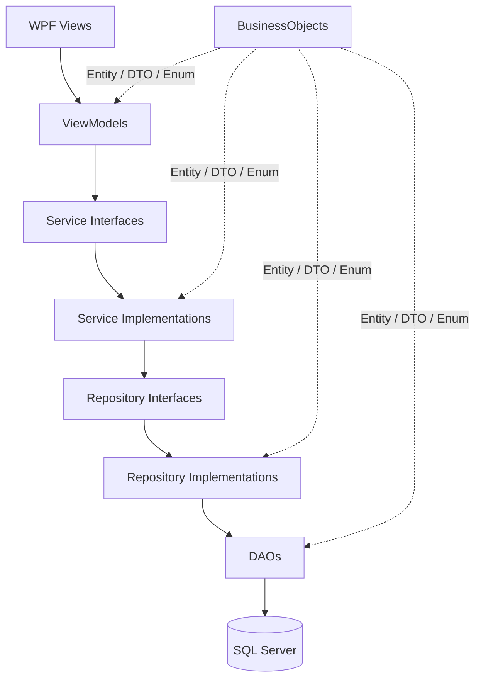
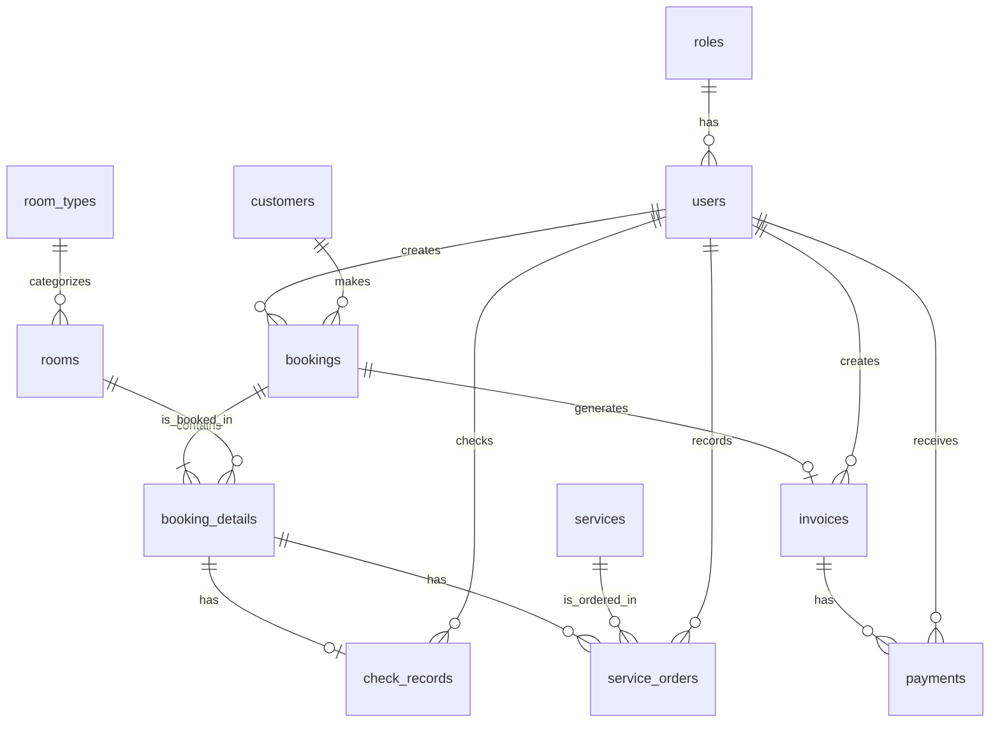

# Hotel Management and Service System

> Ứng dụng quản lý khách sạn nội bộ bằng **C# WPF Desktop Application**, sử dụng **SQL Server**, thiết kế theo **3-Layer Architecture**, **MVVM**, **Repository Pattern** và cách chia việc **vertical slice fullstack**.

---

## Mục lục

- [1. Giới thiệu dự án](#1-giới-thiệu-dự-án)
- [2. Phạm vi hệ thống](#2-phạm-vi-hệ-thống)
- [3. Chức năng chính](#3-chức-năng-chính)
- [4. Phân quyền người dùng](#4-phân-quyền-người-dùng)
- [5. Luồng nghiệp vụ tổng thể](#5-luồng-nghiệp-vụ-tổng-thể)
- [6. Công nghệ sử dụng](#6-công-nghệ-sử-dụng)
- [7. Kiến trúc hệ thống](#7-kiến-trúc-hệ-thống)
- [8. Cấu trúc solution](#8-cấu-trúc-solution)
- [9. Thiết kế database](#9-thiết-kế-database)
- [10. Quy tắc nghiệp vụ quan trọng](#10-quy-tắc-nghiệp-vụ-quan-trọng)
- [11. Hướng dẫn cài đặt và chạy dự án](#11-hướng-dẫn-cài-đặt-và-chạy-dự-án)
- [12. Git workflow](#12-git-workflow)
- [13. Coding convention](#13-coding-convention)
- [14. Testing checklist](#14-testing-checklist)
- [15. Kịch bản demo cuối kỳ](#15-kịch-bản-demo-cuối-kỳ)
- [16. Phân công module](#16-phân-công-module)
- [17. Release checklist](#17-release-checklist)
- [18. Hướng phát triển thêm](#18-hướng-phát-triển-thêm)

---

## 1. Giới thiệu dự án

**Hotel Management and Service System** là hệ thống quản lý khách sạn và dịch vụ nội bộ, phục vụ quy trình vận hành từ lúc khách đặt phòng đến khi check-in, sử dụng dịch vụ, check-out, lập hóa đơn, thanh toán và xem báo cáo.

Hệ thống được xây dựng dưới dạng **ứng dụng desktop WPF chạy trên Windows**, phù hợp với phạm vi đồ án C#/.NET và SQL Server. Ứng dụng hướng tới nhân viên khách sạn sử dụng nội bộ, không phải hệ thống đặt phòng công khai cho khách hàng bên ngoài.

Điểm quan trọng của hệ thống:

- Nhân viên nội bộ đăng nhập vào hệ thống.
- Phân quyền theo role: `Admin`, `Manager`, `Receptionist`.
- Customer không đăng nhập, chỉ là dữ liệu khách thuê phòng.
- Receptionist là người thao tác nghiệp vụ chính.
- Database dùng SQL Server với 12 bảng lõi.
- Code tuân thủ 5 project: `BusinessObjects`, `DataAccessObjects`, `Repositories`, `Services`, `WPF`.

---

## 2. Phạm vi hệ thống

### 2.1 Trong phạm vi

Hệ thống tập trung vào các nghiệp vụ sau:

- Đăng nhập.
- Phân quyền theo role.
- Quản lý tài khoản nhân viên.
- Quản lý khách thuê phòng.
- Quản lý loại phòng.
- Quản lý phòng.
- Xem sơ đồ phòng.
- Tìm phòng trống theo ngày.
- Tạo booking một phòng hoặc nhiều phòng.
- Check-in.
- Ghi nhận dịch vụ phát sinh.
- Check-out.
- Tạo hóa đơn.
- Nhận thanh toán một phần hoặc toàn bộ.
- Xem dashboard.
- Xem báo cáo công suất phòng, doanh thu, dịch vụ và thanh toán.

### 2.2 Ngoài phạm vi

Hệ thống không bắt buộc có:

- Web API.
- Website đặt phòng công khai.
- Mobile app.
- Cloud deployment.
- Payment gateway thật.
- Tích hợp email/SMS thật.

---

## 3. Chức năng chính

### 3.1 Authentication / Authorization

- Người dùng nội bộ đăng nhập bằng username/password.
- Hệ thống xác định role sau khi login.
- Lưu phiên đăng nhập trong `CurrentSession`.
- Điều hướng menu theo role.
- Logout và xóa session.
- Service vẫn kiểm tra quyền, không chỉ ẩn menu ở UI.

### 3.2 Admin User Management

- Admin xem danh sách user.
- Admin tạo user mới.
- Admin cập nhật thông tin user.
- Admin đổi role cho user.
- Admin khóa/mở tài khoản.
- Không cho tự khóa chính tài khoản đang đăng nhập.
- Không xóa cứng user đã phát sinh dữ liệu nghiệp vụ.

### 3.3 Customer Management

- Tạo customer mới.
- Cập nhật customer.
- Tìm kiếm customer theo tên, số điện thoại, CCCD/CMND/Hộ chiếu.
- Kiểm tra trùng `identity_card` nếu có nhập.
- Không xóa cứng customer đã có booking.

### 3.4 Room Type / Room Management

- Quản lý loại phòng.
- Quản lý phòng cụ thể.
- Gán phòng vào loại phòng.
- Đổi trạng thái vận hành của phòng.
- Không cho booking phòng `Maintenance` hoặc `Inactive`.
- Không xóa cứng phòng đã có booking detail.

### 3.5 Room Map

- Hiển thị sơ đồ phòng theo tầng/phòng.
- Có legend trạng thái rõ ràng.
- Hiển thị các trạng thái: `Available`, `Reserved`, `Occupied`, `Cleaning`, `Maintenance`, `Inactive`.
- Refresh sau booking, check-in, check-out.

### 3.6 Booking

- Tìm phòng trống theo khoảng ngày.
- Tạo booking cho một phòng.
- Tạo booking cho nhiều phòng.
- Chặn booking trùng lịch.
- Lưu giá phòng tại thời điểm booking.
- Tính số đêm và tổng tiền phòng.
- Xem danh sách booking.
- Xem chi tiết booking.
- Cancel booking hợp lệ trước khi check-in.

### 3.7 Check-in / Check-out

- Check-in theo từng `booking_detail_id`.
- Chỉ cho check-in phòng đang `Reserved`.
- Tạo `check_records` khi check-in.
- Lưu thời điểm check-in thực tế.
- Check-out phòng đang `CheckedIn`.
- Lưu thời điểm check-out thực tế.
- Cập nhật room status thành `Cleaning` sau check-out.

### 3.8 Service / Service Order

- Quản lý danh mục dịch vụ.
- Ghi nhận dịch vụ phát sinh cho phòng đang ở.
- Lưu `unit_price` tại thời điểm gọi dịch vụ.
- Tính `total_price = quantity * unit_price`.
- Hủy service order nếu hợp lệ.

### 3.9 Invoice / Payment

- Tạo invoice sau khi booking đủ điều kiện check-out.
- Một booking chỉ có tối đa một invoice.
- Tính tiền phòng.
- Tính tiền dịch vụ.
- Áp dụng discount/tax nếu có.
- Thanh toán một phần hoặc toàn bộ.
- Không cho thanh toán vượt quá số tiền còn lại.
- Cập nhật invoice status: `Unpaid`, `PartiallyPaid`, `Paid`.
- Booking chuyển `Completed` khi đã check-out và thanh toán đủ.

### 3.10 Dashboard / Report

- Tổng số phòng.
- Số phòng Available/Reserved/Occupied/Cleaning/Maintenance.
- Số booking hôm nay.
- Số check-in hôm nay.
- Số check-out hôm nay.
- Báo cáo công suất phòng.
- Báo cáo doanh thu.
- Báo cáo sử dụng dịch vụ.
- Báo cáo thanh toán.
- Export CSV là chức năng optional.

---

## 4. Phân quyền người dùng

### 4.1 Admin

Admin có thể:

- Quản lý tài khoản nhân viên.
- Quản lý role cơ bản.
- Quản lý loại phòng.
- Quản lý phòng.
- Quản lý dịch vụ.
- Xem dashboard.
- Xem report.

### 4.2 Manager

Manager có thể:

- Xem dashboard.
- Xem tình trạng phòng.
- Xem danh sách booking.
- Xem báo cáo công suất phòng.
- Xem báo cáo doanh thu.
- Xem báo cáo sử dụng dịch vụ.
- Xem báo cáo thanh toán.

### 4.3 Receptionist

Receptionist là role thao tác nghiệp vụ chính:

- Tạo/cập nhật customer.
- Tìm phòng trống.
- Tạo booking.
- Check-in.
- Ghi nhận service order.
- Check-out.
- Tạo invoice.
- Nhận payment.

### 4.4 Customer

Customer không đăng nhập hệ thống.

Customer chỉ là dữ liệu khách thuê phòng được lưu trong bảng `customers`.

---

## 5. Luồng nghiệp vụ tổng thể

### 5.1 Luồng demo chính

```text
Login Receptionist
→ Tạo hoặc tìm customer
→ Chọn ngày check-in/check-out
→ Tìm phòng trống
→ Tạo booking nhiều phòng
→ Room Map hiển thị Reserved
→ Check-in từng phòng
→ Room Map hiển thị Occupied
→ Gọi dịch vụ cho phòng đang ở
→ Check-out
→ Room status chuyển Cleaning
→ Tạo invoice
→ Thanh toán một phần hoặc toàn bộ
→ Booking Completed
→ Manager/Admin xem dashboard và report
```

### 5.2 Luồng tạo booking

```text
Receptionist đăng nhập
→ Tìm hoặc tạo customer
→ Chọn ngày check-in/check-out dự kiến
→ Kiểm tra phòng trống theo khoảng ngày
→ Tạo bookings
→ Tạo booking_details cho từng phòng được chọn
→ Cập nhật status booking = Confirmed hoặc Pending
```

### 5.3 Luồng check-in

```text
Receptionist tìm booking
→ Chọn booking detail/phòng cần check-in
→ Kiểm tra booking detail đang Reserved
→ Tạo check_records
→ Lưu actual_check_in_date
→ Lưu check_in_by_user_id
→ Cập nhật booking_details.status = CheckedIn
```

### 5.4 Luồng ghi nhận dịch vụ

```text
Khách đang lưu trú yêu cầu dịch vụ
→ Receptionist chọn phòng/booking detail
→ Chọn service
→ Nhập quantity
→ Hệ thống lấy giá hiện tại của service làm unit_price
→ Tính total_price = quantity * unit_price
→ Tạo service_orders
```

### 5.5 Luồng check-out

```text
Receptionist tìm booking detail/phòng đang CheckedIn
→ Kiểm tra các service order phát sinh
→ Cập nhật actual_check_out_date trong check_records
→ Lưu check_out_by_user_id
→ Cập nhật booking_details.status = CheckedOut
→ Cập nhật rooms.status = Cleaning
```

### 5.6 Luồng tạo hóa đơn

```text
Sau khi khách check-out
→ Tính tổng tiền phòng từ booking_details
→ Tính tổng tiền dịch vụ từ service_orders
→ Áp dụng discount/tax nếu có
→ Tạo invoices
→ invoices.status = Unpaid
```

### 5.7 Luồng thanh toán

```text
Receptionist nhận tiền từ khách
→ Tạo payments
→ Cập nhật invoices.paid_amount
→ Cập nhật invoices.remaining_amount
→ Nếu remaining_amount = 0 thì invoices.status = Paid
→ Nếu paid_amount > 0 nhưng chưa đủ thì invoices.status = PartiallyPaid
→ Nếu booking đã check-out và paid thì bookings.status = Completed
```

---

## 6. Công nghệ sử dụng

| Thành phần | Công nghệ |
|---|---|
| Programming Language | C# |
| Desktop UI | WPF |
| Architecture | 3-Layer Architecture |
| UI Pattern | MVVM |
| Data Pattern | Repository Pattern + DAO |
| Database | SQL Server |
| IDE | Visual Studio |
| Version Control | Git + GitHub |
| Target Platform | Windows Desktop |

---

## 7. Kiến trúc hệ thống

### 7.1 Luồng gọi code chuẩn

```text
WPF View
→ ViewModel
→ Service Interface
→ Service Implementation
→ Repository Interface
→ Repository Implementation
→ DAO
→ SQL Server
```

### 7.2 Mapping 3 layer

| Layer | Project | Trách nhiệm |
|---|---|---|
| Presentation Layer | `WPF` | View, ViewModel, Command, Navigation, UI state |
| Business Logic Layer | `Services` | Business rules, validation, transaction orchestration |
| Data Access Layer | `Repositories` + `DataAccessObjects` | Repository trung gian, DAO truy cập SQL Server |
| Shared Model | `BusinessObjects` | Entity, DTO, Enum, Constants |

### 7.3 Project reference rules

| Project | Được reference |
|---|---|
| `BusinessObjects` | Không reference project nào khác |
| `DataAccessObjects` | `BusinessObjects` |
| `Repositories` | `BusinessObjects`, `DataAccessObjects` |
| `Services` | `BusinessObjects`, `Repositories` |
| `WPF` | `BusinessObjects`, `Services` |

### 7.4 Architecture diagram



---

## 8. Cấu trúc solution

```text
HotelManagementSystem.sln
├── BusinessObjects
│   ├── Entities
│   ├── DTOs
│   ├── Enums
│   └── Constants
│
├── DataAccessObjects
│   ├── DBContext.cs hoặc DbContextFactory.cs
│   ├── DAOs
│   ├── SQLScripts
│   │   ├── 001_create_database.sql
│   │   ├── 002_create_tables.sql
│   │   ├── 003_constraints.sql
│   │   └── 004_seed_data.sql
│   └── SeedData
│
├── Repositories
│   ├── Interfaces
│   └── Implements
│
├── Services
│   ├── Interfaces
│   ├── Implements
│   ├── Validators
│   └── Helpers
│
└── WPF
    ├── Views
    ├── ViewModels
    ├── Commands
    ├── Resources
    ├── Helpers
    ├── Converters
    ├── App.xaml
    └── appsettings.json
```

---

## 9. Thiết kế database

### 9.1 Danh sách bảng chính

Database có 12 bảng lõi:

| Nhóm | Bảng | Vai trò |
|---|---|---|
| Phân quyền | `roles`, `users` | Lưu role và tài khoản nhân viên nội bộ |
| Khách thuê | `customers` | Lưu khách đặt/thuê phòng, không đăng nhập |
| Phòng | `room_types`, `rooms` | Lưu loại phòng, giá cơ bản, phòng cụ thể và trạng thái vận hành |
| Đặt phòng | `bookings`, `booking_details` | `bookings` là đơn tổng, `booking_details` là từng phòng trong booking |
| Lưu trú | `check_records` | Lưu check-in/check-out thực tế theo từng booking detail |
| Dịch vụ | `services`, `service_orders` | Lưu dịch vụ khách sạn và dịch vụ phát sinh |
| Thanh toán | `invoices`, `payments` | Lưu hóa đơn tổng và các lần thanh toán |

### 9.2 ERD rút gọn



### 9.3 Giải thích bảng

#### `roles`

Lưu danh sách role trong hệ thống:

- `Admin`
- `Manager`
- `Receptionist`

#### `users`

Lưu tài khoản đăng nhập của nhân viên nội bộ.

Các trường quan trọng:

- `username`
- `password_hash`
- `full_name`
- `email`
- `phone_number`
- `role_id`
- `status`

#### `customers`

Lưu thông tin khách thuê phòng.

Các trường quan trọng:

- `full_name`
- `identity_card`
- `phone_number`
- `email`
- `address`

#### `room_types`

Lưu loại phòng, giá cơ bản, sức chứa và trạng thái.

Các trường quan trọng:

- `type_name`
- `description`
- `base_price`
- `capacity`
- `status`

#### `rooms`

Lưu từng phòng cụ thể trong khách sạn.

Các trường quan trọng:

- `room_number`
- `floor`
- `room_type_id`
- `status`
- `note`

Lưu ý: `rooms.status` chỉ là trạng thái vận hành. Phòng có trống theo ngày hay không phải kiểm tra trong `booking_details`.

#### `bookings`

Lưu thông tin booking tổng.

Một booking thuộc về một customer và có thể có nhiều booking detail.

#### `booking_details`

Lưu từng phòng trong một booking.

Đây là bảng quan trọng nhất để xác định:

- Phòng nào được đặt.
- Ngày check-in/check-out dự kiến.
- Giá phòng tại thời điểm đặt.
- Số đêm.
- Tổng tiền phòng.
- Trạng thái từng phòng trong booking.

#### `check_records`

Lưu thông tin check-in/check-out thực tế của từng booking detail.

Bảng này giúp phân biệt:

- Ngày check-in/check-out dự kiến trong `booking_details`.
- Ngày check-in/check-out thực tế trong `check_records`.

#### `services`

Lưu danh sách dịch vụ khách sạn.

Ví dụ:

- Giặt ủi.
- Nước suối.
- Ăn sáng.
- Spa.
- Mini bar.
- Thuê xe.

#### `service_orders`

Lưu dịch vụ khách sử dụng trong quá trình lưu trú.

Mỗi service order gắn với một `booking_detail_id` để biết dịch vụ thuộc phòng nào trong booking.

#### `invoices`

Lưu hóa đơn tổng của booking.

Một booking nên có tối đa một invoice.

#### `payments`

Lưu các lần thanh toán của invoice.

Một invoice có thể có nhiều payments, ví dụ thanh toán một phần bằng tiền mặt và phần còn lại bằng chuyển khoản.

---

## 10. Quy tắc nghiệp vụ quan trọng

### 10.1 Không được đặt trùng phòng

Khi tạo hoặc cập nhật `booking_details`, hệ thống phải kiểm tra phòng có bị trùng lịch hay không.

Điều kiện trùng lịch:

```sql
new_check_in_date < existing_check_out_date
AND new_check_out_date > existing_check_in_date
```

Chỉ kiểm tra với booking detail còn hiệu lực:

- `Reserved`
- `CheckedIn`

Không cần chặn với booking detail đã:

- `Cancelled`
- `CheckedOut`
- `NoShow`

### 10.2 Check-out date phải lớn hơn check-in date

```text
booking_details.check_out_date > booking_details.check_in_date
```

### 10.3 Số đêm phải lớn hơn 0

```text
number_of_nights > 0
number_of_nights = số ngày giữa check_out_date và check_in_date
```

### 10.4 Tổng tiền phòng

```text
room_total = room_price * number_of_nights
```

`room_price` phải lấy từ `room_types.base_price` tại thời điểm booking.

### 10.5 Số lượng dịch vụ phải lớn hơn 0

```text
service_orders.quantity > 0
```

### 10.6 Tổng tiền service order

```text
service_orders.total_price = service_orders.quantity * service_orders.unit_price
```

`unit_price` phải lưu lại tại thời điểm gọi dịch vụ để hóa đơn cũ không bị thay đổi khi giá dịch vụ thay đổi sau này.

### 10.7 Tổng tiền invoice

```text
room_amount = SUM(booking_details.room_total)
service_amount = SUM(service_orders.total_price)
total_amount = room_amount + service_amount + tax_amount - discount_amount
remaining_amount = total_amount - paid_amount
```

### 10.8 Payment không được vượt quá invoice total

```text
SUM(payments.amount where status = Success) <= invoices.total_amount
```

### 10.9 Một booking chỉ có tối đa một invoice

Nên đặt unique constraint cho:

```text
invoices.booking_id
```

### 10.10 Một booking detail chỉ có tối đa một check record

Nên đặt unique constraint cho:

```text
check_records.booking_detail_id
```

### 10.11 Status đề xuất

| Nhóm | Status |
|---|---|
| User | `Active`, `Inactive`, `Locked` |
| Room Type | `Active`, `Inactive` |
| Room | `Available`, `Cleaning`, `Maintenance`, `Inactive` |
| Booking | `Pending`, `Confirmed`, `Cancelled`, `Completed`, `NoShow` |
| Booking Detail | `Reserved`, `CheckedIn`, `CheckedOut`, `Cancelled`, `NoShow` |
| Check Record | `CheckedIn`, `CheckedOut`, `Cancelled` |
| Service | `Active`, `Inactive` |
| Service Order | `Ordered`, `Cancelled` |
| Invoice | `Unpaid`, `PartiallyPaid`, `Paid`, `Cancelled` |
| Payment | `Success`, `Failed`, `Refunded` |

### 10.12 Payment method đề xuất

| Method | Ý nghĩa |
|---|---|
| `Cash` | Tiền mặt |
| `BankTransfer` | Chuyển khoản ngân hàng |
| `CreditCard` | Thẻ tín dụng/thẻ ghi nợ |
| `EWallet` | Ví điện tử |

---

## 11. Hướng dẫn cài đặt và chạy dự án

### 11.1 Yêu cầu môi trường

Cài đặt các công cụ sau:

- Windows 10/11.
- Visual Studio có workload **.NET Desktop Development**.
- SQL Server hoặc SQL Server Express.
- SQL Server Management Studio hoặc Azure Data Studio.
- Git.

### 11.2 Clone repository

```bash
git clone <repository-url>
cd HotelManagementSystem
```

### 11.3 Mở solution

Mở file sau bằng Visual Studio:

```text
HotelManagementSystem.sln
```

### 11.4 Tạo database

Chạy SQL scripts theo đúng thứ tự:

```text
DataAccessObjects/SQLScripts/001_create_database.sql
DataAccessObjects/SQLScripts/002_create_tables.sql
DataAccessObjects/SQLScripts/003_constraints.sql
DataAccessObjects/SQLScripts/004_seed_data.sql
```

Kiểu dữ liệu SQL Server đề xuất:

| Kiểu trong ERD | Kiểu SQL Server đề xuất |
|---|---|
| `int` | `INT IDENTITY(1,1)` cho khóa chính |
| `string` | `NVARCHAR(...)` |
| `decimal` | `DECIMAL(18,2)` |
| `datetime` | `DATETIME2` |

Nên dùng `NVARCHAR` thay vì `VARCHAR` để lưu tiếng Việt có dấu.

### 11.5 Cấu hình connection string

Cập nhật file:

```text
WPF/appsettings.json
```

Ví dụ dùng SQL Server local:

```json
{
  "ConnectionStrings": {
    "DefaultConnection": "Server=.;Database=HotelManagementSystem;Trusted_Connection=True;TrustServerCertificate=True;"
  }
}
```

Ví dụ dùng SQL Server Express:

```json
{
  "ConnectionStrings": {
    "DefaultConnection": "Server=.\\SQLEXPRESS;Database=HotelManagementSystem;Trusted_Connection=True;TrustServerCertificate=True;"
  }
}
```

### 11.6 Chạy ứng dụng

Trong Visual Studio:

```text
Right click WPF project
→ Set as Startup Project
→ Build Solution
→ Run
```

### 11.7 Tài khoản seed

Tài khoản seed mặc định nên được định nghĩa trong:

```text
DataAccessObjects/SQLScripts/004_seed_data.sql
```

Sau khi đăng nhập bằng tài khoản Admin seed, có thể tạo thêm Manager và Receptionist trong màn hình User Management.

---

## 12. Git workflow

### 12.1 Branch strategy

```text
main
├── develop
├── feature/member1-auth-billing
├── feature/member2-booking-room
├── feature/member3-operation-service
├── feature/member4-report-dashboard
├── fix/*
└── release/final-demo
```

### 12.2 Commit convention

```text
feat(auth): implement login service
feat(booking): add available room search
feat(checkin): create check-in flow
feat(payment): add partial payment validation
fix(invoice): prevent duplicate invoice
fix(room): correct room availability query
docs(readme): update setup guide
```

### 12.3 Pull request rules

Mỗi pull request cần có:

- Issue ID.
- Scope đã làm.
- Screenshot nếu có thay đổi UI.
- Test evidence.
- Ghi rõ có thay đổi database script hay không.
- Ghi rõ module bị ảnh hưởng.

Không merge nếu:

- Solution không build.
- WPF reference DAO trực tiếp.
- ViewModel chứa SQL.
- Bỏ qua Service để gọi Repository/DAO trực tiếp.
- Đổi schema database nhưng chưa được Leader và DB owner review.
- Code làm hỏng module của thành viên khác.

---

## 13. Coding convention

### 13.1 Quy tắc kiến trúc

- WPF không được reference `DataAccessObjects`.
- WPF không được gọi DAO trực tiếp.
- WPF không được gọi Repository trực tiếp nếu đã có Service.
- WPF không được viết SQL query.
- ViewModel không chứa business logic phức tạp.
- ViewModel chỉ xử lý binding, command, UI state, validation nhẹ và gọi Service.
- Service là nơi chứa business rules chính.
- Repository là lớp trung gian giữa Service và DAO.
- DAO là nơi duy nhất làm việc trực tiếp với SQL Server.
- BusinessObjects chỉ chứa Entity, DTO, Enum, Constants.
- Không tạo reference ngược tầng.

### 13.2 Quy tắc WPF/MVVM

- View chỉ mô tả giao diện bằng XAML.
- ViewModel expose property và command để binding.
- Dùng `RelayCommand` cho các thao tác button/menu.
- `BaseViewModel` implement `INotifyPropertyChanged`.
- Không xử lý nghiệp vụ trong code-behind.
- Code-behind chỉ dùng cho xử lý UI thuần nếu thật sự cần.
- Lỗi validate phải hiển thị trên UI, không để app crash.

### 13.3 Quy tắc Service

- Service validate quyền theo role.
- Service validate business rules.
- Service trả về `ServiceResult<T>` hoặc object kết quả tương đương.
- Không throw exception trực tiếp ra UI với lỗi nghiệp vụ thông thường.
- Các thao tác ghi dữ liệu quan trọng nên chạy trong transaction.

### 13.4 Quy tắc DAO

- DAO đọc connection string từ configuration.
- Không hard-code server name trong DAO.
- Dùng parameterized SQL để tránh SQL Injection.
- DAO không chứa UI logic.
- DAO không chứa logic điều hướng màn hình.

---

## 14. Testing checklist

### 14.1 Auth testing

- [ ] Login đúng username/password thành công.
- [ ] Sai username/password hiển thị lỗi.
- [ ] User `Inactive` không login được.
- [ ] User `Locked` không login được.
- [ ] Sau login có `CurrentSession` đầy đủ.
- [ ] Logout clear `CurrentSession`.

### 14.2 Architecture testing

- [ ] WPF không reference DAO.
- [ ] WPF không reference Repositories trực tiếp.
- [ ] ViewModel không chứa SQL.
- [ ] ViewModel không gọi DAO/Repository trực tiếp.
- [ ] Service chứa business rule chính.
- [ ] DAO là nơi duy nhất truy cập SQL Server.

### 14.3 Booking testing

- [ ] Tạo booking cho một phòng.
- [ ] Tạo booking cho nhiều phòng.
- [ ] Tìm phòng trống theo khoảng ngày.
- [ ] Chặn phòng bị trùng lịch.
- [ ] Chặn booking phòng `Maintenance` hoặc `Inactive`.
- [ ] Lưu đúng room price tại thời điểm booking.
- [ ] Tính đúng number of nights.
- [ ] Tính đúng room total.
- [ ] Sau booking, Room Map hiển thị `Reserved`.

### 14.4 Check-in / Check-out testing

- [ ] Chỉ `Reserved` booking detail mới check-in được.
- [ ] Check-in tạo check record.
- [ ] Booking detail chuyển `CheckedIn`.
- [ ] Room Map hiển thị `Occupied`.
- [ ] Chỉ `CheckedIn` booking detail mới check-out được.
- [ ] Check-out cập nhật actual check-out date.
- [ ] Booking detail chuyển `CheckedOut`.
- [ ] Room status chuyển `Cleaning`.

### 14.5 Service order testing

- [ ] Thêm service order cho phòng đang `CheckedIn`.
- [ ] Chặn quantity nhỏ hơn hoặc bằng 0.
- [ ] Lưu unit price tại thời điểm order.
- [ ] Tính đúng total price.
- [ ] Service order được tính vào invoice.

### 14.6 Invoice / Payment testing

- [ ] Tạo invoice chỉ khi booking đủ điều kiện checkout.
- [ ] Không tạo duplicate invoice cho cùng booking.
- [ ] Tính đúng room amount.
- [ ] Tính đúng service amount.
- [ ] Tính đúng total amount.
- [ ] Thanh toán một phần cập nhật `PartiallyPaid`.
- [ ] Thanh toán đủ cập nhật `Paid`.
- [ ] Không cho thanh toán vượt remaining amount.
- [ ] Booking chuyển `Completed` khi đủ điều kiện.

### 14.7 Dashboard / Report testing

- [ ] Dashboard load không crash khi chưa có nhiều dữ liệu.
- [ ] Dashboard hiển thị tổng số phòng.
- [ ] Dashboard hiển thị số phòng theo trạng thái.
- [ ] Occupancy report lọc được theo ngày.
- [ ] Revenue report tính đúng doanh thu đã thanh toán.
- [ ] Service usage report group đúng theo dịch vụ.
- [ ] Empty state hiển thị rõ ràng.

---

## 15. Kịch bản demo cuối kỳ

```text
1. Login bằng tài khoản Receptionist.
2. Tạo customer mới.
3. Chọn ngày check-in/check-out.
4. Tìm phòng trống.
5. Tạo booking nhiều phòng.
6. Mở Room Map và xác nhận phòng hiển thị Reserved.
7. Check-in một phòng trong booking.
8. Mở Room Map và xác nhận phòng hiển thị Occupied.
9. Ghi nhận service order cho phòng đang ở.
10. Check-out phòng.
11. Xác nhận room status chuyển Cleaning.
12. Tạo invoice cho booking.
13. Xem invoice detail gồm tiền phòng và tiền dịch vụ.
14. Thanh toán một phần.
15. Thanh toán phần còn lại.
16. Xác nhận invoice status = Paid.
17. Xác nhận booking status = Completed.
18. Login bằng Manager/Admin.
19. Xem dashboard.
20. Xem report công suất phòng, doanh thu và dịch vụ.
```

---

## 16. Phân công module

### 16.1 Member 1 — Leader / Auth / Admin User / Billing / Integration

Sở hữu chính:

- `roles`
- `users`
- `invoices`
- `payments`
- `CurrentSession`
- Login
- Role navigation
- Admin User Management
- Invoice
- Payment
- Billing UI
- Integration review

Không làm chính:

- Customer CRUD.
- Room CRUD.
- Booking Create.
- Check-in/Service Order.
- Report query chính.

### 16.2 Member 2 — Customer / Room / Booking / Room Map

Sở hữu chính:

- `customers`
- `room_types`
- `rooms`
- `bookings`
- `booking_details`
- Customer Management
- Room Type Management
- Room Management
- Room Map
- Available Room Search
- Booking Conflict Validation
- Booking List/Cancel/History

Không làm chính:

- Auth.
- Admin User Management.
- Check-in.
- Service Order.
- Invoice/Payment.
- Report/Dashboard chính.

### 16.3 Member 3 — Stay Operation / Service / Check-in / Check-out

Sở hữu chính:

- `check_records`
- `services`
- `service_orders`
- Check-in
- Service Catalog
- Service Order
- Check-out
- Operation flow

Không làm chính:

- Booking Create.
- Invoice/Payment.
- Dashboard/Report chính.
- Admin User Management.

### 16.4 Member 4 — Dashboard / Report / QA / Docs

Sở hữu chính:

- Dashboard
- Occupancy Report
- Revenue Report
- Service Usage Report
- Report filters
- Export CSV optional
- README
- User Manual
- Demo Script
- Manual Test Cases

Không làm chính:

- Auth core.
- Booking Create.
- Check-in/Check-out business logic.
- Invoice/Payment business logic.
- DB schema chính nếu chưa thống nhất với Member 2 và Leader.

---

## 17. Release checklist

Trước khi nộp/demo final:

- [ ] SQL scripts đầy đủ.
- [ ] Seed data đầy đủ.
- [ ] Solution build được ở Release mode.
- [ ] WPF project được set làm startup project.
- [ ] Full demo script chạy được.
- [ ] Không vi phạm reference tầng.
- [ ] README đã cập nhật.
- [ ] User manual đã cập nhật.
- [ ] Manual test cases đã hoàn thành.
- [ ] Có final branch hoặc release tag.

---

## 18. Hướng phát triển thêm

Có thể mở rộng thêm sau MVP:

- Export invoice PDF.
- Print invoice.
- Audit log.
- Dashboard chart nâng cao.
- Room cleaning workflow riêng.
- Booking deposit.
- Customer booking history.
- Database backup/restore guide.
- Unit test cho Services.
- GitHub Actions build pipeline.

---

## 19. Trạng thái hoàn thành kỳ vọng

Project được xem là hoàn thành MVP khi chạy được đầy đủ luồng:

```text
Login
→ Customer
→ Room / Room Map
→ Booking
→ Check-in
→ Service Order
→ Check-out
→ Invoice
→ Payment
→ Dashboard / Report
```

Hệ thống phải chạy bằng dữ liệu thật trong SQL Server, giao diện WPF đúng phân quyền và code không vi phạm kiến trúc 3 layer + MVVM.
